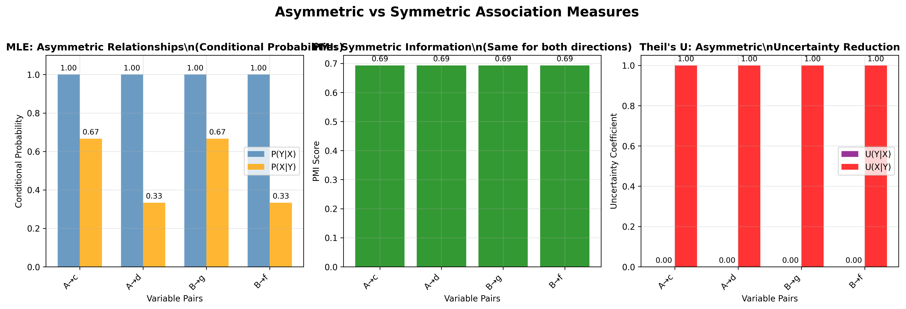
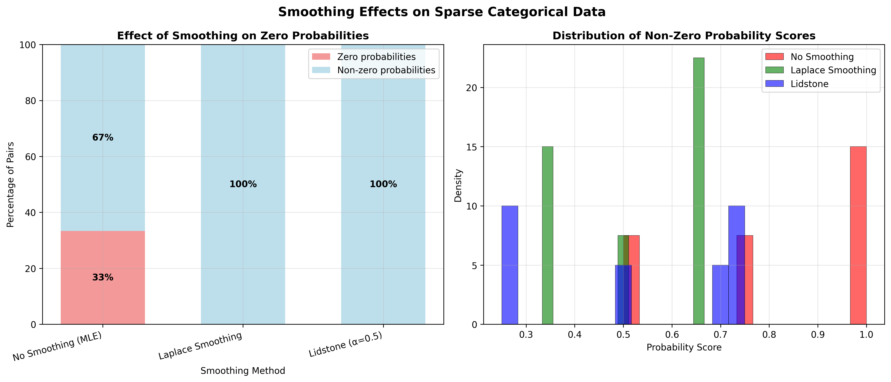
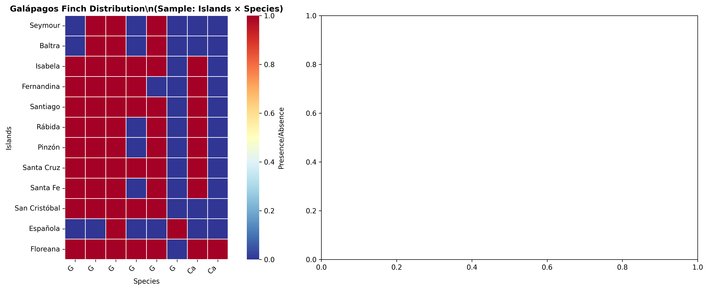
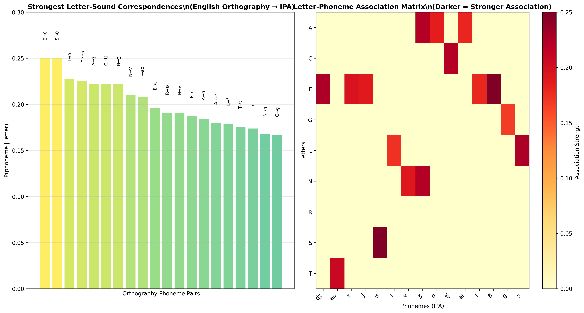

# ASymCat: Asymmetric Categorical Association Analysis

[](https://badge.fury.io/py/asymcat)
[](https://pypi.org/project/asymcat/)
[](https://github.com/tresoldi/asymcat/actions)
[](https://codecov.io/gh/tresoldi/asymcat)
[](https://opensource.org/licenses/MIT)

ASymCat is a comprehensive Python library for analyzing **asymmetric associations** between categorical variables. Unlike traditional symmetric measures that treat relationships as bidirectional, ASymCat provides directional measures that reveal which variable predicts which, making it invaluable for understanding causal relationships, dependencies, and information flow in categorical data.

## 🎯 Why Asymmetric Measures Matter

Traditional measures like Pearson's χ² or Cramér's V treat associations as symmetric: the relationship between X and Y is the same as between Y and X. However, many real-world relationships are inherently directional:

- **Language Evolution**: Sound changes may be predictable in one direction but not the other
- **Species Co-occurrence**: Presence of species A may predict species B, but not vice versa
- **Market Analysis**: Product A sales may predict product B sales directionally
- **Medical Diagnosis**: Symptoms may predict conditions more reliably than conditions predict symptoms

ASymCat quantifies these directional relationships, revealing hidden patterns that symmetric measures miss.

## 🧬 Scientific Foundation

### Asymmetric vs. Symmetric Association

Consider this example from categorical data analysis:

| Observation | Variable X | Variable Y |
|-------------|------------|------------|
| 1           | A          | c          |
| 2           | A          | d          |
| 3           | A          | c          |
| 4           | B          | g          |
| 5           | B          | g          |
| 6           | B          | f          |

**Key Insight**: While you cannot perfectly predict Y from X, you can perfectly predict X from Y:
- If Y = c or d, then X = A (100% certainty)
- If Y = f or g, then X = B (100% certainty)
- But if X = A, Y could be c or d (uncertainty)
- If X = B, Y could be f or g (uncertainty)

### Asymmetric Analysis Results

Using ASymCat's asymmetric measures:

**X given Y (Perfect Prediction)**:
| Y → X | A    | B    |
|-------|------|------|
| c     | 1.00 | 0.00 |
| d     | 1.00 | 0.00 |
| f     | 0.00 | 1.00 |
| g     | 0.00 | 1.00 |

**Y given X (Uncertain Prediction)**:
| X → Y | c    | d    | f    | g    |
|-------|------|------|------|------|
| A     | 0.67 | 0.33 | 0.00 | 0.00 |
| B     | 0.00 | 0.00 | 0.33 | 0.67 |

This asymmetry reveals the **directional dependency** structure in your data.

### Mathematical Visualization

The following plot demonstrates how different measures capture asymmetric vs symmetric relationships:



**Key Insights:**
- **MLE (Left)**: Shows clear asymmetry - P(Y|X) ≠ P(X|Y)
- **PMI (Center)**: Symmetric measure - same value regardless of direction
- **Theil's U (Right)**: Captures uncertainty reduction asymmetrically

### Robust Probability Estimation

ASymCat integrates the **freqprob library** for sophisticated probability estimation:



**Smoothing Benefits:**
- **No Smoothing**: Many zero probabilities for rare events
- **Laplace Smoothing**: Eliminates zeros by adding pseudo-counts
- **Lidstone Smoothing**: Parameterized smoothing with adjustable strength

## 🔬 Available Measures

ASymCat implements 15+ association measures, each capturing different aspects of categorical relationships:

### Information-Theoretic Measures
- **Mutual Information (MI)**: Measures shared information between variables
- **Normalized MI**: MI scaled to [0,1] range for comparability
- **Pointwise Mutual Information (PMI)**: Local association strength for specific value pairs
- **Conditional Entropy**: Uncertainty in one variable given another
- **Theil's U**: Uncertainty coefficient, ideal for linguistic and social science data

### Statistical Association Measures
- **Maximum Likelihood Estimation (MLE)**: Direct probabilistic association
- **Chi-square (χ²)**: Both 2×2 and 3×2 contingency table variants
- **Cramér's V**: Normalized chi-square, both squared and non-squared versions
- **Fisher's Exact Test**: Exact probabilities for small samples
- **Log-Likelihood Ratio (G²)**: Alternative to chi-square for nested models

### Similarity-Based Measures
- **Jaccard Index**: Set similarity between variable contexts
- **Goodman-Kruskal Lambda (λ)**: Proportional reduction in prediction error

### Specialized Measures
- **Tresoldi Score**: Novel measure combining MLE and PMI, optimized for historical linguistics
- **Custom Scalers**: Transform any measure using minmax, standardization, or custom scaling

## 🚀 Quick Start

### Installation

```bash
# Standard installation
pip install asymcat

# With all optional features
pip install "asymcat[all]"

# Development installation
pip install "asymcat[dev]"
```

### Basic Usage

```python
import asymcat

# Load your categorical data
data = asymcat.read_sequences("your_data.tsv")  # Tab-separated format
cooccs = asymcat.collect_cooccs(data)
scorer = asymcat.scorer.CatScorer(cooccs)

# Compute asymmetric associations
mle_scores = scorer.mle()                    # Maximum likelihood
pmi_scores = scorer.pmi()                    # Pointwise mutual information
theil_scores = scorer.theil_u()              # Theil's uncertainty coefficient
jaccard_scores = scorer.jaccard_index()      # Jaccard similarity

# Each score returns (X→Y, Y→X) directional measures
for pair, (xy, yx) in mle_scores.items():
    print(f"{pair[0]} → {pair[1]}: {xy:.3f}")
    print(f"{pair[1]} → {pair[0]}: {yx:.3f}")
```

### Command-Line Interface

ASymCat provides a powerful CLI for non-programmatic analysis:

```bash
# Basic analysis
asymcat data.tsv --scorers mle pmi theil_u

# Advanced analysis with filtering and output
asymcat data.tsv \
  --scorers all \
  --top 10 \
  --min-count 5 \
  --output results.json \
  --verbose

# N-gram analysis
asymcat sequences.tsv \
  --ngrams 3 \
  --scorers tresoldi mutual_information \
  --output-format csv

# Multiple output formats
asymcat data.tsv --scorers mle --table-format markdown > report.md

# Advanced smoothing for sparse data
asymcat data.tsv --scorers mle pmi_smoothed --smoothing laplace
asymcat data.tsv --scorers mle --smoothing lidstone --smoothing-alpha 0.5
```

## 🌍 Real-World Applications

### Species Co-occurrence Analysis

Analyze ecological relationships in the Galápagos finch dataset:



**Ecological Insights:**
- **Left**: Species distribution across islands shows habitat preferences
- **Right**: Strongest associations reveal co-occurrence patterns and potential ecological dependencies
- **Asymmetric relationships**: Some species predict others' presence better than vice versa

### Linguistic Pattern Analysis

Examine English orthography-phoneme relationships:



**Linguistic Discoveries:**
- **Left**: Letter-sound correspondence strengths reveal systematic patterns
- **Right**: Association matrix shows which letters map to which phonemes most reliably
- **Predictive asymmetry**: Orthography often predicts phonetics better than the reverse

## 📊 Detailed Example: Mushroom Classification

Let's analyze mushroom characteristics to understand edibility prediction:

```python
import asymcat
import pandas as pd

# Load mushroom data (edibility vs. cap shape)
data = asymcat.read_sequences("resources/mushroom-small.tsv")
cooccs = asymcat.collect_cooccs(data)
scorer = asymcat.scorer.CatScorer(cooccs)

# Compute multiple measures
results = {
    'MLE': scorer.mle(),
    'Theil_U': scorer.theil_u(),
    'Mutual_Info': scorer.mutual_information(),
    'Tresoldi': scorer.tresoldi()
}

# Analyze edible mushrooms with bell-shaped caps
pair = ('edible', 'bell')
print("Edible ↔ Bell-shaped caps:")
for measure, scores in results.items():
    xy, yx = scores[pair]
    print(f"  {measure}: edible→bell={xy:.3f}, bell→edible={yx:.3f}")
```

Output:
```
Edible ↔ Bell-shaped caps:
  MLE: edible→bell=0.385, bell→edible=1.000
  Theil_U: edible→bell=0.000, bell→edible=1.000
  Mutual_Info: edible→bell=0.000, bell→edible=0.000
  Tresoldi: edible→bell=0.596, bell→edible=1.000
```

**Interpretation**: Bell-shaped caps perfectly predict edibility (bell→edible=1.000), but edible mushrooms don't reliably predict bell shape (edible→bell=0.385). This asymmetric relationship suggests bell-shaped caps are a strong indicator of edible mushrooms.

## 📈 Data Input Formats

### Sequential Data (TSV format)
```
Orthography    Phonetics
d o g          d ɔ g
c a t          k æ t
h o u s e      h aʊ s
```

### Presence-Absence Matrices
```
ID         Species_A  Species_B  Species_C
Island_1   1          0          1
Island_2   1          1          0
Island_3   0          1          1
```

### Programmatic Data
```python
# List of sequence pairs
data = [
    [['d', 'o', 'g'], ['d', 'ɔ', 'g']],
    [['c', 'a', 't'], ['k', 'æ', 't']],
    [['h', 'o', 'u', 's', 'e'], ['h', 'aʊ', 's']]
]

# Process directly
cooccs = asymcat.collect_cooccs(data)
```

## 🛠️ Advanced Features

### N-gram Analysis
```python
# Analyze 3-gram patterns in sequences
data = asymcat.read_sequences("sequences.tsv")
trigram_cooccs = asymcat.collect_cooccs(data, order=3, pad="#")
scorer = asymcat.scorer.CatScorer(trigram_cooccs)
```

### Score Transformation
```python
# Scale scores to different ranges
scores = scorer.mle()
normalized = asymcat.scorer.scale_scorer(scores, method="minmax")  # [0,1]
standardized = asymcat.scorer.scale_scorer(scores, method="stdev") # z-scores
inverted = asymcat.scorer.invert_scorer(normalized)                # 1-score
```

### Matrix Operations
```python
# Convert scores to matrices for visualization/analysis
scores = scorer.tresoldi()
xy_matrix, yx_matrix, x_labels, y_labels = asymcat.scorer.scorer2matrices(scores)

# Use with matplotlib, seaborn, etc.
import seaborn as sns
sns.heatmap(xy_matrix, xticklabels=y_labels, yticklabels=x_labels)
```

## 🎓 Use Cases by Field

### Computational Linguistics
- **Historical linguistics**: Sound change directionality
- **Phonotactics**: Consonant-vowel co-occurrence patterns
- **Morphology**: Affix dependency relationships
- **Syntax**: Word order asymmetries

### Ecology & Evolution
- **Species co-occurrence**: Predator-prey relationships
- **Habitat preference**: Environmental factor dependencies
- **Evolutionary patterns**: Trait correlation directionality
- **Biogeography**: Range overlap asymmetries

### Social Sciences
- **Market research**: Product purchase dependencies
- **Sociology**: Social network influence patterns
- **Psychology**: Behavioral correlation directionality
- **Economics**: Economic indicator relationships

### Data Science
- **Feature engineering**: Variable dependency discovery
- **Causal inference**: Directional relationship identification
- **Anomaly detection**: Asymmetric pattern recognition
- **Recommendation systems**: User-item preference asymmetries

## 📚 Installation Options

### Core Installation
```bash
pip install asymcat
```

### Development Installation
```bash
# Individual feature groups
pip install "asymcat[test]"        # Testing tools
pip install "asymcat[docs]"        # Documentation building
pip install "asymcat[lint]"        # Code quality tools
pip install "asymcat[security]"    # Security scanning
pip install "asymcat[jupyter]"     # Jupyter notebook support
pip install "asymcat[viz]"         # Additional visualization
pip install "asymcat[performance]" # Profiling tools

# Combined installations
pip install "asymcat[dev]"         # Core development tools
pip install "asymcat[all]"         # Everything
```

## 🤝 Contributing

We welcome contributions! Please see our [Contributing Guidelines](CONTRIBUTING.md) for details.

### Development Setup
```bash
git clone https://github.com/tresoldi/asymcat.git
cd asymcat
pip install -e ".[dev]"
pre-commit install
```

### Running Tests
```bash
pytest tests/                     # Run test suite
pytest --cov=asymcat tests/      # With coverage
python -m asymcat --help         # Test CLI
```

## 📖 Documentation

- **[Mathematical Foundations](docs/MATHEMATICAL_FOUNDATIONS.md)**: Complete mathematical basis and derivations
- **[Interactive Examples](docs/EXAMPLES_WITH_PLOTS.ipynb)**: Comprehensive Jupyter notebook with visualizations
- **[Documentation Hub](docs/README.md)**: Complete guide to all documentation
- **[Development Guide](CLAUDE.md)**: For contributors and Claude Code
- **CLI Reference**: `asymcat --help` for command-line usage
- **API Reference**: Auto-generated from docstrings

## 🔒 Security

ASymCat includes comprehensive security scanning:
- **Dependency Vulnerability Scanning**: Daily automated checks
- **Code Security Analysis**: Bandit, CodeQL integration
- **License Compliance**: Automated license compatibility checks

Report security issues to [tiago.tresoldi@lingfil.uu.se](mailto:tiago.tresoldi@lingfil.uu.se)

## 📊 Performance

ASymCat is optimized for both small exploratory analyses and large-scale research:

- **Memory Efficient**: Sparse matrix representations for large datasets
- **Parallel Processing**: Multi-core support for intensive computations
- **Caching**: Intelligent result caching for repeated analyses
- **Scalable**: Tested with datasets up to 100K+ co-occurrence pairs

## 🌟 Related Projects

- **[pyitlib](https://github.com/pafoster/pyitlib)**: Information theory measures in Python
- **[dython](https://github.com/shakedzy/dython)**: Data analysis tools with association measures
- **[GoodmanKruskal (R)](https://cran.r-project.org/web/packages/GoodmanKruskal/)**: R implementation of λ and τ measures
- **[cooccur (R)](https://cran.r-project.org/web/packages/cooccur/)**: Species co-occurrence analysis

## 📄 Citation

If you use ASymCat in your research, please cite:

```bibtex
@software{tresoldi2024asymcat,
  title        = {ASymCat: Asymmetric Categorical Association Analysis},
  author       = {Tresoldi, Tiago},
  year         = {2024},
  version      = {0.3.0},
  url          = {https://github.com/tresoldi/asymcat},
  publisher    = {GitHub},
}
```

## 👨‍💻 Author & Funding

**Tiago Tresoldi** ([tiago.tresoldi@lingfil.uu.se](mailto:tiago.tresoldi@lingfil.uu.se))
- Uppsala University, Department of Linguistics and Philology

**Funding**:
- [Cultural Evolution of Texts](https://github.com/evotext/) project
- [Riksbankens Jubileumsfond](https://www.rj.se/) (grant [MXM19-1087:1](https://www.rj.se/en/anslag/2019/cultural-evolution-of-texts/))
- [European Research Council](https://erc.europa.eu/) (grant [#715618](https://cordis.europa.eu/project/rcn/206320/factsheet/en), [Computer-Assisted Language Comparison](https://digling.org/calc/))

## 📜 License

Released under the [MIT License](LICENSE).

---

<div align="center">

**[🏠 Homepage](https://github.com/tresoldi/asymcat)** •
**[📚 Documentation](https://github.com/tresoldi/asymcat)** •
**[🐛 Issues](https://github.com/tresoldi/asymcat/issues)** •
**[💬 Discussions](https://github.com/tresoldi/asymcat/discussions)**

</div>
